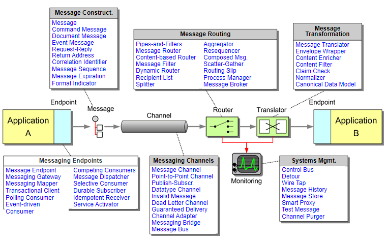

# EIP 

[](https://www.enterpriseintegrationpatterns.com/patterns/messaging/)

# 常见通信模式

## 1、PubSub 模式 （event message常用）
```text
Endpoint (Producer) -----> messageMapper -----> producer outbound channel -----> router -----> buffer (queue, topic)
----->  consumer inbound channel -----> messageMapper -----> Endpoint (Consumer)
```
常用单工通道, producer 走 outbound channel, consumer 走 inbound channel

consumer 通常有3种方式：拉，推，推拉结合

## 2、Exchange 模式 （request reply message常用）
```text
Endpoint (Requester) -----> messageMapper -----> sender channel -----> router -----> network , broker channel (queue,
topic) -----> request receiver -----> receiver channel -----> Endpoint (Replier)

Endpoint (Requester) <----- messageMapper <----- receiver channel <----- router <----- network , broker channel (queue,
topic) <----- reply sender     <----- send channel     <----- Endpoint (Replier)
```

常用 双工通道, request message 走 outbound channel, reply message 走 inbound channel

## 关键术语解释

## Endpoint

在 pub-sub 通信模式下， endpoint 代表了 producer (s), consumer (s) (消息可以是 consumer 拉取，也可以是推给 consumer), dispatcher (消息推送给 dispatcher)

在 exchange 模式下， endpoint 代表了 requester(s) (client), replier(s) (server)

## Endpoint 处理模型: MessageMapper, MessageDispatcher

### MessageMapper
```
如果message 在进入 outbound 之前， message 可以是任何形态、格式 的话，通常要先使用 message mapper将 任意格式的 message 转成 统一格式的message。 

如果message 在离开 inbound 之前， message 必然是统一格式，通常要先使用 message mapper将 统一格式的message 转换成期望的格式的 message。
```
### MessageDispatcher

endpoint 常用的处理模型为dispatcher

## Channel

channel 是为了方便对message的处理，建立的一个处理通道而已。


```text
    1. channel 按照流向分为2种： inbound channel, outbound channel, 如果将它俩结合，可以衍生出一种： duplex channel 一个channel 必有 两端: src,dest ,channel的
    
    2. 两端均可以有多种形式： 其中一端是 endpoint, 另外一个或多个 channel, buffer (queue, topic)，所以会有point-to-point, pub-sub 
```


在pub-sub 模式下，多用单工 channel，在 exchange模式下， 多用 duplex channel


## Channel 处理模型：Pipeline, Chain

channel 上常用的处理模型为：pipeline, chain, 不论是 pipeline还是 chain，它们上面都有很多的message handler，并且 这些handler是串行执行。

### Pipeline 
Pipeline 上每一个 message handler 的输出将作为下一个 message handler的输入

单工通信时，有单向的 pipeline, 例如:
```text
    Java 8的 Stream, langx-java中的 集合包下的 pipeline
    logstash 等 日志系统中，对日志的加工时，用的就是单向 pipeline
```

双工通信时，有双工的 pipeline，例如:
```text
    Netty 中的 pipeline
    langx-java 的 com.jn.langx.pipeline 包
    Tomcat 容器，
```


### Chain
Chain 上每一个 message handler 都将接收到同一个 message

单工通信时，有向的 chain，例如：
```text
    功能链模式
```

双工通信时，有双工的 chain，例如：
```text
    Servlet 规范中的 Filter Chain
    Spring WebMvc 中的 HandlerMethod Interceptor Chain
```

## MessageHandler

一个handler 可以对 一个message 数据进行一定的处理，例如 转换，富化，路由，拆分，合并等；
如果一个message 要历经多个 handler的处理，通常用pipeline或者 chain 


