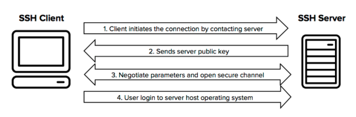

SSH https://www.ssh.com/ssh/


目前开源的ssh client有很多，支持情况也都不一样，下面就做一些对比：

|project|License|JDK supports|maven|
|-------|-------|------------|-----|
| JSch  | BSD   |1.6+        | ```com.jcraft:jsch:0.1.55 ``` |
|sshj   |Apache 2.0|1.6+     | ```net.schmizz:sshj:0.10.0``` |
|ganymed-ssh2 |Apache 2.0|1.8+|```com.airlenet.yang:ganymed-ssh2:1.2.0```|
|trilead-ssh2 |Apache 2.0|1.8+|```com.trilead:trilead-ssh2:1.0.0-build222```|
|j2ssh|||```sshtools:j2ssh-core:0.2.9```|


Java版开源ssh框架功能对比：

|对比项      |Jsch      | sshj     |ganymed-ssh2|trilead-ssh2|j2ssh   |
|---------  |----------|----------|------------|------------|--------|
|License    | BSD      |Apache 2.0| Apache 2.0 |Trilead AG  | 未知    |
|JDK supports | 1.6+   |1.6+      |1.8+        |JDK 4+      | JDK11 + |
|代码可读性  | C        | A        | A          |A           | B       |

ganymed-ssh2 与 trilead-ssh2 代码基本是一致的

## 1、协议说明

[标准规范](https://datatracker.ietf.org/wg/secsh/documents/)



[参考连接](http://web.mit.edu/rhel-doc/4/RH-DOCS/rhel-rg-en-4/s1-ssh-conn.html)

### 1.1 流程

ssh 协议的流程一般是这样的：
```text
1、创建TCP连接、key exchange
2、进行身份认证
3、打开一个Channel，进行交互，关闭Channel；然后重复 3
4、关闭tcp连接
```

其中第3步，是循环执行的，完成一个channel后，可以继续打开另外一个channel。

### 1.2 Key Exchange
key exchange 是在ssh client 通过tcp连接到server后发生的，流程如下：

+ Keys are exchanged
+ The public key encryption algorithm is determined
+ The symmetric encryption algorithm is determined
+ The message authentication algorithm is determined
+ The hash algorithm is determined

在 key exchange 期间，server 用唯一的 host_key 来识别它自己到client的关系。
如果client 之前从未连接过某个server，那么server的 host_key 对于client来说就是 unknown的，这种情况下就不能连接的。
如果client 在连到一个从未连接过的server时，server 会回传 host_key 到client，client 如果验证通过后，则会写入到known_hosts中。
如果client 在连到一个已连接过的server时，会将 known_hosts 中的host_key和server 的host_key进行验证。
验证通过后，连接才真正建立。

在服务端，如果使用的是OpenSSH时，通常 host keys会被存在在 /etc/ssh 目录（该目录可配置）下，以ssh_host_<rsa/dsa/ecdsa/ed25519>_key 为开始的文件里。

在客户端，通常存在known_hosts文件，文件位置可以是在：/etc/ssh/known_hosts 或者 是在 .ssh/known_hosts 


### 1.3 Authentication
连接建立后，server 会告诉client 所有支持的方式，例如使用 private key进行的签名，或者使用password 。client 选择一种方式去进行认证。


### 1.4 Channel
在认证通过后，基于一个连接，可以打开多个 channel，这是通过多路复用技术完成的。

```
   All terminal sessions, forwarded connections, etc., are channels.
   Either side may open a channel.  Multiple channels are multiplexed
   into a single connection.

   Channels are identified by numbers at each end.  The number referring
   to a channel may be different on each side.  Requests to open a
   channel contain the sender's channel number.  Any other channel-
   related messages contain the recipient's channel number for the
   channel.

   Channels are flow-controlled.  No data may be sent to a channel until
   a message is received to indicate that window space is available.
```


Channel 分类：

+ Direct
  + Direct TCP/IP PORT
  + Interactive Sessions
    + Shell
    + Subsystem
    + Command
+ Forwarded
  + X11
  + Forwarded TCP/IP PORT


## 2、OpenSSH Channel Multiplexing 

### 2.1 功能简介

在 OpenSSH 中 Multiplexing 功能支持同一主机的多个 SSH 会话共享单一 TCP 连接进行通讯，一旦第一个连接建立，后续连接就不再需要凭证，从而消除了每次连接同一机器都需要键入密码的麻烦并且大幅度节省了服务器端的资源。

### 2.2 Channel

[参考连接](https://www.ibm.com/developerworks/cn/opensource/os-cn-openssh-multiplexing/index.html)

常规的tcp连接，在建立后，我们会把整个tcp 连接称为一个 channel。那么这个tcp连接的服务端，就只能针对监听该port的进程有效。tcp的客户端，也只是针对一个进程有效。

OpenSSH 的Channel，跟常规的Channel 并不是一个层面的。它是建立在请求级别的，也就是说，Client每发起一个请求，会建立或复用通过一个channel，这个channel 不是连接级别的，是一个虚拟的。

简而言之，Channel 可以被理解为对 SSH 连接的一次再分割，每一个基于 SSH 的通信会话都可以利用不同的 Channel 来共享同一条连接，以保证对网络资源的最大化利用。

在 SSH 中，所有一切的通信会话，包括 terminal session，connection forward 都是利用 Channel 实现的。

控制终端是进程的一个属性。通过 fork 系统调用创建的子进程会从父进程那里继承控制终端。这样，session 中的所有进程都从 session 领头进程那里继承控制终端。Session 的领头进程称为终端的控制进程(controlling process)。
简单点说就是：一个 session 只能与一个终端关联，这个终端被称为 session 的控制终端(controlling terminal)。同时只能由 session 的领头进程来建立或者改变终端与 session 的联系。


